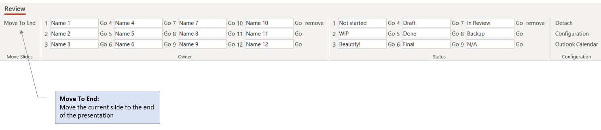

# PPT.ReviewTab
This project is a <b>VSTO PowerPoint AddIn</b> which provides a new Ribbon Tab (called "<i>Review</i>") to make slide deck reviews easier. 

It offers the following functions:

- assign or remove <b>Owner Tags</b> and <b>Status Tags</b> to individual slides with a single mouse click (for example during a group review session).
- Names and color coding of Owner Tags and Status Tags are <b>fully customizable</b>.
- Names of Owners can be <b>imported from the currently open Outlook Calendar Item</b>.
- <b>Move the current slide to the end of the presentation deck</b> with one mouse click.

## Status of project
- Ready to use

## License
This PowerPoint AddIn is free to use under an MIT license. Please find detailed license info in [LICENSE.txt](./LICENSE.txt)

## Prerequisites
You need the following Microsoft Office Products installed on your machine:
- MS PowerPoint
- MS Outlook (optional, only if you wish to use the Import Owner Names from Outlook function)

## Installation
See Release Notes for detailed information. If No detailed info available, proced as follows:
- Download current version to you local machine (any location will do; suggested location is C:\Program Files\True Aquarius\Review Tab)
- Execute Setup.exe

## Usage
### Section "Move Slides"

### Section "Owner"

### Section "Status"

### Section "Configuration"

Importing Owner Names from MS Outlook will open the following warning. You need to grant access in order to import names (please follow Microsoft documentation to grant access permanently).

### Advanced
Advanced users may want to customize the Review tab by manually changing the configuration file. The exact location of the configuration file depends on the user's system configuration. Typically, it can be found here:
- c:\\[<i>users</i>]\\[<i>user name</i>]\AppData\Roaming\Ture Aquarius\Review Tab

## Tech Stack
That's what you need to know in order to contribute
- C#
- VSTO 
- WPF (Windows Presentation Framework)
- Newtonsoft.Json
- Visual Studio 2022

